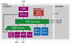

# Note on EX1
Because of the directory structure of github repositpory, the file locations are a little different compared with the guidance on the VLSI website.
The adder8 design is placed under `croc/adder8` folder.
The `Makefile` already contains a target to run the Verilator simulation, but we highly recommand you to follow the steps described in Exercise 1 to understand the process.

The Post-layout simulation unfortunately cannot be published at this moment because of the use of some commercial tool.
We are now working on a workaround and plan to switch to open-sourced tool in the second half of the year.

# Croc System-on-Chip

A simple SoC for education using PULP IPs. Croc includes all scripts necessary to produce a nearly finished chip in [IHPs open-source 130nm technology](https://github.com/IHP-GmbH/IHP-Open-PDK/tree/main).

As it is oriented towards education, it forgoes some configurability to increase readability of the RTL and scripts.

Croc is developed as part of the PULP project, a joint effort between ETH Zurich and the University of Bologna.

Croc was sucesfully taped out in Nov 2024. The chip is called [MLEM](http://asic.ee.ethz.ch/2024/MLEM.html), named after the sound Yoshi makes when eating a tasty fruit.
MLEM was designed and prepared for tapeout by ETHZ students as a bachelor project. The exact code and scripts used for the tapeout can be seen in the frozen [mlem-tapeout](https://github.com/pulp-platform/croc/tree/mlem-tapeout) branch.


## Architecture



The SoC is composed of two main parts:
- The `croc_domain` containing a CVE2 core (a fork of Ibex), SRAM, an OBI crossbar and a few simple peripherals 
- The `user_domain` where students are invited to add their own designs or other open-source designs (peripherals, accelerators...)

The main interconnect is OBI, you can find [the spec online](https://github.com/openhwgroup/obi/blob/072d9173c1f2d79471d6f2a10eae59ee387d4c6f/OBI-v1.6.0.pdf). 

The various IPs of the SoC (UART, OBI, debug-module, timer...) come from other PULP repositories and are managed by [Bender](https://github.com/pulp-platform/bender).
To make it easier to browse and understand, only the currently used files are included in `rtl/<IP>`. You may want to explore the repositories of the respective IPs to find their documentation or additional functionality, the urls are in `Bender.yml`.

## Configuration

The main SoC configurations are in `rtl/croc_pkg.sv`:

| Parameter           | Default          | Function                                              |
|---------------------|------------------|-------------------------------------------------------|
| `HartId`            | `0`              | Core's Hart ID                                        |
| `PulpJtagIdCode`    | `32'hED9_C0C50`  | Debug module ID code                                  |
| `NumExternalIrqs`   | `4`              | Number of external interrupts into Croc domain        |
| `BankNumWords`      | `512`            | Number of 32bit words in a memory bank                |
| `NumSramBanks`      | `2`              | Number of memory banks                                |

The SRAMs are instantiated via a technology wrapper called `tc_sram` (tc: tech_cells), the technology-independent implementation is in `rtl/tech_cells_generic/tc_sram.sv`. A number of SRAM configurations are implemented using IHP130 SRAM memories in `ihp13/tc_sram.sv`. If an unimplemented SRAM configuration is instantiated it will result in a `tc_sram_blackbox` module which can then be easily identified from the synthesis results.

## Bootmodes

Currently the only way to boot is via JTAG.

## Memory Map

If possible, the memory map should remain compatible with [Cheshire's memory map](https://pulp-platform.github.io/cheshire/um/arch/#memory-map).  
Further each new subordinate should occupy multiples of 4KB of the address space (`32'h0000_1000`).

The address map of the default configuration is as follows:

| Start Address   | Stop Address    | Description                                |
|-----------------|-----------------|--------------------------------------------|
| `32'h0000_0000` | `32'h0004_0000` | Debug module (JTAG)                        |
| `32'h0300_0000` | `32'h0300_1000` | SoC control/info registers                 |
| `32'h0300_2000` | `32'h0300_3000` | UART peripheral                            |
| `32'h0300_5000` | `32'h0300_6000` | GPIO peripheral                            |
| `32'h0300_A000` | `32'h0300_B000` | Timer peripheral                           |
| `32'h1000_0000` | `+SRAM_SIZE`    | Memory banks (SRAM)                        |
| `32'h2000_0000` | `32'h8000_0000` | Passthrough to user domain                 |
| `32'h2000_0000` | `32'h2000_1000` | reserved for string formatted user ROM*    |


*If people modify Croc we suggest they add a ROM at this address containing additional information 
like the names of the developers, a project link or similar. This can then be written out via UART.  
We ask people to format the ROM like a C string with zero termination and using ASCII encoding if feasible.  
The [MLEM user ROM](https://github.com/pulp-platform/croc/blob/mlem-tapeout/rtl/user_domain/user_rom.sv) may serve as a reference implementation.

## Flow

1. Bender provides a list of SystemVerilog files
2. Yosys parses, elaborates, optimizes and maps the design to the technology cells
3. The netlist, constraints and floorplan are loaded into OpenRoad for Place&Route
4. The design as def is read by klayout and the geometry of the cells and macros are merged

Currently, the final GDS is still missing the following things:
- metal density fill
- sealring
These can be added in KLayout, check the [IHP repository](https://github.com/IHP-GmbH/IHP-Open-PDK/tree/main) (possible the dev branch) for a reference script.

### Example Results
Cell/Module placement                      |  Routing
:-----------------------------------------:|:------------------------------------:
  |  


## Requirements
We are using the excellent docker container maintained by Harald Pretl. If you get stuck with installing the tools, we urge you to check the [Tool Repository](https://github.com/iic-jku/IIC-OSIC-TOOLS).  
The current supported version is 2024.11, no other version is tested or officially supported.

### ETHZ systems
An environment setup for bash is provided.
```sh
source ethz.env
```

### Other systems
**Note: this has currently only been tested on Ubuntu and RHEL Linux.**

#### Docker (easy) 
There are two possible ways, the easiest way is to install docker and work in the docker container, you can follow the install guides on the [Docker Website](https://docs.docker.com/desktop/).  
You do not need to manually download the container image, this will be done when running the script.
If you do not have `git` installed on your system, you also need to install [Github Desktop](https://desktop.github.com/download/) and then clone this git repository.  

It is a good idea to grant non-root (`sudo`) users access to docker, this is decribed in the [Docker Article](https://docs.docker.com/engine/install/linux-postinstall/#manage-docker-as-a-non-root-user).

Finally, you can navigate to this directory, open a terminal (PowerShell in Windows) and type:
```sh
# Linux only (starts and enters docker container in shell)
./start_linux.sh
# Linux/Mac (starts VNC server on localhost:5901)
./start_vnc.sh
# Windows (starts VNC server on localhost:5901)
./start_vnc.bat
```

If you use the VNC option, open a browser and type `localhost` in the address bar. 
This should connect you to the VNC server, the password is `abc123`, then test by right-clicking somewhere, starting the terminal and typing `ls`.  
You should see the files in this repository again.

Now you should be in an Ubuntu environment with all tools pre-installed for you.  
If something does not work, refer to the upstream [IIC-OSIC-Tools](https://github.com/iic-jku/IIC-OSIC-TOOLS/tree/main)

#### Native install (hard)
You need to build/install the required tools manually:

- [Bender](https://github.com/pulp-platform/bender#installation): Dependency manager
- [Yosys](https://github.com/YosysHQ/yosys#building-from-source): Synthesis tool
- [Yosys-Slang](https://github.com/povik/yosys-slang): SystemVerilog frontend for Yosys
- [OpenRoad](https://github.com/The-OpenROAD-Project/OpenROAD/blob/master/docs/user/Build.md): Place & Route tool
- (Optional) [Verilator](https://github.com/verilator/verilator): Simulator
- (Optional) Questasim/Modelsim: Simulator


## Getting started
The SoC is fully functional as-is and a simple software example is provided for simulation.
To run the synthesis and place & route flow execute:
```sh
make checkout
make yosys
make openroad
make klayout
```

To simulate you can use:
```sh
make verilator
```

If you have Questasim/Modelsim, you can also run:
```sh
make vsim
```


The most important make targets are documented, you can list them with:
```sh
make help
```

## Bender
The dependency manager [Bender](https://github.com/pulp-platform/bender) is used in most pulp-platform IPs.
Usually each dependency would be in a seperate repository, each with a `Bender.yml` file to describe where the RTL files are, how you can use this dependency and which additional dependency it has.
In the top level repository (like this SoC) you also have a `Bender.yml` file but you will commonly find a `Bender.lock` file. It contains the resolved tree of dependencies with specific commits for each. Whenever you run a command using Bender, this is the file it uses to figure out where things are.

Below is a small guide aimed at the usecase for this project. The Bender repo has a more extensive [Command Guide](https://github.com/pulp-platform/bender?tab=readme-ov-file#commands).

### Checkout
Using the command `bender checkout` Bender will check the lock file and download the specified commits from the repositories (usually into a hidden `.bender` directory). 

### Update
Running `bender update` on the other hand will resolve the entire tree again and re-generate the lock file (you usually have to resolve some version/revision conflicts if multiple things use the same dependency).

**Remember:** always test everything again if you generate a new `Bender.lock`, it is the same as modifying RTL.

### Local Versions
For this repository, we use a subcommand called `bendor vendor` together with the `vendor_package` section in `Bender.yml`.
`bendor vendor` can be used to Benderize arbitrary repositories with RTL in it. The dependencies are already 'checked out' into `rtl/<IP>`. Each file or directory from the repository is mapped to a local path in this repo.
Fixes and changes to each IPs `rtl/<IP>/Bender.yml` are managed by `bender vendor` in `rtl/patches`.

If you need to update a dependency or map another file you need to edit the coresponding `vendor_package` section in `Bender.yml` and then run `bender vendor init`. Then you might need to change `rtl/<IP>/Bender.yml` to list your new file in the sources. 
To save a fix/change as a patch, stage it in git and then run `bender vendor patch`. When prompted, add a commit message (this is used as the patches file name). Finally, commit both the patch file and the new `rtl/<IP>`.

**Note:** using `bender vendor` in this repository to change the local versions of the IPs requires an up-to-date version of Bender, specifically it needs to include [PR 179](https://github.com/pulp-platform/bender/pull/179).

### Targets
Another thing we use are targets (in the `Bender.yml`), together they build different views/contexts of your RTL. For example without defining any targets the technology independent cells/memories are used (in `rtl/tech_cells_generic/`) but if we use the target `ihp13` then the same modules contain a technology-specific implementation (in `ihp13/`). Similar contexts are built for different simulators and other things.

## License
Unless specified otherwise in the respective file headers, all code checked into this repository is made available under a permissive license. All hardware sources and tool scripts are licensed under the Solderpad Hardware License 0.51 (see `LICENSE.md`). All software sources are licensed under Apache 2.0.
