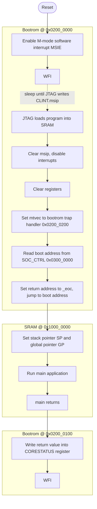

# Bootrom

The bootrom is a small read-only memory that runs immediately after reset.
Its job is to initialize the CPU, wait for a JTAG debugger to load a program into SRAM, and then jump to it.
The hardcoded instructions in `bootrom.sv` are synthesized into a small cluster of logic gates (<~600GE).
Because it lives in dedicated ROM hardware, the code here does not consume any of the limited SRAM space, freeing it up for user code.

## SoC Memory Map

The relevant addresses for this system are:

| Region    | Base address  | Size   |
|-----------|---------------|--------|
| Bootrom   | `0x0200_0000` |   4 KB |
| CLINT     | `0x0204_0000` | 256 KB |
| SOC_CTRL  | `0x0300_0000` |   4 KB |
| SRAM      | `0x1000_0000` |   ? KB |

The CPU reset vector (ie the boot address given to the CPU itself) points to `0x0200_0000`, the first instruction of the bootrom.  
The address of the application is stored in the `SOC_CTRL` registers in `BOOTADDR`.

### Fixed Offsets inside the Bootrom

The bootrom is divided into four contiguous blocks at fixed offsets so that
addresses are stable regardless of code changes in other sections:

| Offset  | Label                  | Purpose                                  |
|---------|------------------------|------------------------------------------|
| `0x000` | `_start`               | WFI trampoline, register init, boot jump |
| `0x100` | `_eoc`                 | End-of-computation: write status, halt   |
| `0x200` | `_trap_handler_wrapper`| Save regs, read mcause, dispatch         |
| `0x300` | `_trap_exit`           | Restore regs, `mret`                     |

## Boot Flow



The JTAG workflow uses the CLINT's machine software interrupt pending bit(`msip`) as a wakeup signal:
the debugger writes a program into SRAM, then sets `msip` to wake the core.
Then the environment is cleared to default values, the `BOOTADDR` is read and then the core jumps to the address given there to exectute the main application.
Once it is done, it returns to the bootrom to write the return value to the `CORE_STATUS` register and the core is halted.

### Software Split: Bootrom vs. `crt0.S`

A traditional bare-metal setup uses a startup file (`crt0.S`) to do everything done in the bootrom and a bit more, this is then written to the SRAM along the main application. The bootrom takes most of the responsibility from `crt0.S` and moves it here. However, some things require knowledge of the complete system or the software setup, all of this is not moved to the bootrom and is still done in a traditional but now reduced `crt0.S`.

Here an overview of the responsibilities of the bootrom and `crt0.S`:

| Task                              | Traditional crt0  | Croc bootrom  | Croc crt0 |
|-----------------------------------|:-----------------:|:-------------:|:---------:|
| Clear integer registers           | yes               | **yes**       | —         |
| Set `mtvec` (trap vector)         | yes               | **yes**       | —         |
| Trap handler (save/restore regs)  | yes               | **yes**       | —         |
| Dispatch to user trap handlers    | yes               | **yes**       | —         |
| End-of-computation signalling     | yes               | **yes**       | —         |
| Set stack pointer (`sp`)          | yes               | —             | yes       |
| Set global pointer (`gp`)         | yes               | —             | yes       |
| Jump to `main()`                  | yes               | —             | yes       |

The stack pointer is **not** set in the bootrom because it depends on the SRAM layout.
The SRAM `crt0` (`sw/crt0.S`) handles this and is the only startup code that may need to change when the memory configuration changes.

## Trap Dispatch Protocol

Because the trap handler itself is in ROM (immutable), user programs provide their handlers via a small **function pointer table** placed at the very start of SRAM (`0x1000_0000`):

```
0x1000_0000:  j _start                      # jump over the table (skip on normal entry)
0x1000_0004:  .word croc_exception_handler  # function pointer used by bootrom
0x1000_0008:  .word croc_interrupt_handler  # function pointer used by bootrom
```

When a trap fires:

1. `_trap_handler_wrapper` saves the 10 caller-saved registers onto the stack.
2. It reads `mcause`: MSB=1 means interrupt, MSB=0 means exception.
3. It loads the appropriate function pointer from the SRAM table and calls it,
   passing the interrupt ID (with MSB stripped) in `a0`.
4. `_trap_exit` restores the registers and executes `mret`.

Default (weak) handlers are provided in `crt0.S` and simply return.
Override the functions `croc_exception_handler` or `croc_interrupt_handler` in your software to add real handling.

## Hardware Implementation

The module is a purely combinational ROM with a one-cycle OBI response latency
(the request is registered, data is presented one cycle later, standard for SRAM-like peripherals).

The ROM is stored as four `localparam` arrays, one per section.
The upper 4 bits of the word address select the array; the lower 6 bits index into it.
Write accesses are always rejected with an OBI error and return the value `0xBADCAB1E`.

The instruction words in `bootrom.sv` are the assembled output of `bootrom.S`.
If you _need_ to change the bootrom (not recommended), edit `bootrom.S`, reassemble, and update the hex words in `bootrom.sv`.
