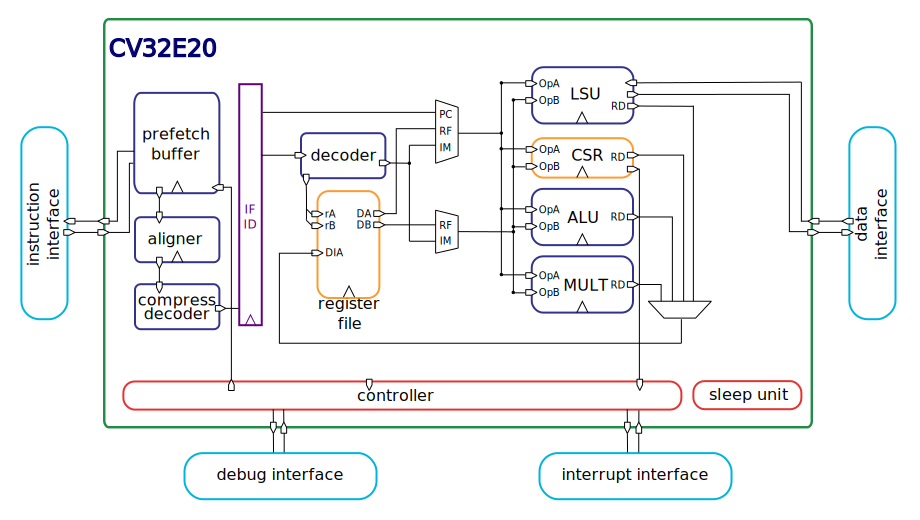

# OpenHW Group CORE-V CVE2 RISC-V IP

CVE2 is a class of 2-stage pipeline OpenHW Group cores. Currently, the only core in this class is the CV32E20.
CV32E20 is a fork of the [Ibex](https://github.com/lowRISC/ibex) core.
Differently to Ibex, cv32e2 will target low cost as originally intended in the [Zero-riscy](https://doi.org/10.1109/PATMOS.2017.8106976) project.
The core will be made compatible with the OpenHW Group OBI protocol, it will use the same sleep unit of CV32E4 family, and it will achieve TRL5 with the industrial-level verification [core-v-verif](https://github.com/openhwgroup/core-v-verif).

# CV32E20 RISC-V Core

CV32E20 is a production-quality open source source 32-bit RISC-V CPU core written in
SystemVerilog. The CPU core is heavily parametrizable and well-suited for
embedded control applications. CV32E20 is being extensively verified and has
seen multiple tape-outs. CV32E20 supports the Integer (I) or Embedded (E),
Integer Multiplication and Division (M), and Compressed (C) extensions.

The block diagram below shows the *small* parametrization with a 2-stage
pipeline.

CV32E20 was initially developed as part of the [PULP platform](https://www.pulp-platform.org)
under the name [&#34;Zero-riscy&#34;](https://doi.org/10.1109/PATMOS.2017.8106976), and has been
contributed to [lowRISC](https://www.lowrisc.org) who maintains it and develops it further.
It was further adopted by the OpenHW Group to work towards an improved industrialization

## Verification

The verification environment for the CVE2 is _not_ in this Repository.  There is a small, simple testbench here which is
useful for experimentation only and should not be used to validate any changes to the RTL prior to pushing to the master
branch of this repo.

The verification environment for this core as well as other cores in the OpenHW Group CORE-V family is at the
[core-v-verif](https://github.com/openhwgroup/core-v-verif) repository on GitHub.

The Makefiles supported in the **core-v-verif** project automatically clone the appropriate version of the **cve2** RTL sources.

## Changelog

A changelog is generated automatically in the documentation from the individual pull requests.
In order to enable automatic changelog generation within the documentation, the committer is required to label each pull request
that touches any file in 'rtl' (or any of its subdirectories) with *Component:RTL* and label each pull request that touches any file in
'docs' (or any of its subdirectories) with *Component:Doc*. Pull requests taht are not labeled or labeled with *ignore-for-release* are
ignored for the changelog generation.

Only the person who actually performs the merge can add these labels (you need committer rights). The changelog flow only works if at most
1 label is applied and therefore pull requests that touch both RTL and documentation files in the same pull request are not allowed.

## Configuration

CV32E20 offers several configuration parameters to meet the needs of various application scenarios.
The options include different choices for the architecture of the multiplier unit, as well as a range of performance and security features.
The table below indicates performance, area, and verification status for a few selected configurations.
These are configurations on which lowRISC is focusing for performance evaluation and design verification (see [supported configs](cve2_configs.yaml)).

| Config                            | "micro" | "small"               |
| --------------------------------- | ------- | --------------------- |
| Features                          | RV32EC  | RV32IMC, 3 cycle mult |
| Performance (CoreMark/MHz)        | 0.904   | 2.47                  |
| Area - Yosys (kGE)                | 16.85   | 26.60                 |
| Area - Commercial (estimated kGE) | ~15     | ~24                   |
| Verification status               |         |                       |

Notes:

* Performance numbers are based on CoreMark running on the CV32E20 Simple System [platform](examples/simple_system/README.md).
  Note that different ISAs (use of B and C extensions) give the best results for different configurations.
  See the [Benchmarks README](examples/sw/benchmarks/README.md) for more information.
* Yosys synthesis area numbers are based on the CV32E20 basic synthesis [flow](syn/README.md) using the latch-based register file.
* Commercial synthesis area numbers are a rough estimate of what might be achievable with a commercial synthesis flow and technology library.
* For comparison, the original "zero-riscy" core yields an area of 23.14kGE using our Yosys synthesis flow.
* Verification status is a rough guide to the overall maturity of a particular configuration.
  Green indicates that verification is close to complete.
  Amber indicates that some verification has been performed, but the configuration is still experimental.
  Red indicates a configuration with minimal/no verification.
* v.1.0.0 of the RISC-V Bit-Manipulation Extension is supported as well as the remaining sub-extensions of draft v.0.93 of the bitmanip spec.
  The latter is *not ratified* and there may be changes before ratification.
  See [Standards Compliance](https://ibex-core.readthedocs.io/en/latest/01_overview/compliance.html) in the Ibex documentation for more information.

## Documentation (to be updated)

The CVE2 documentation can be
[read online at ReadTheDocs](https://docs.openhwgroup.org/projects/cve2-user-manual/en/latest/). It is also contained in
the `doc` folder of this repository.

## Examples

The CVE2 repository includes [Simple System](examples/simple_system/README.md).
This is an intentionally simple integration of CV32E20 with a basic system that targets simulation.
It is intended to provide an easy way to get bare metal binaries running on CV32E20 in simulation.

## Contributing

We highly appreciate community contributions. We are currently using the lowRISC contribution guide.
To ease our work of reviewing your contributions,
please:

* Create your own fork to commit your changes and then open a Pull Request to the **dev** branch.
* Split large contributions into smaller commits addressing individual changes or bug fixes. Do not
  mix unrelated changes into the same commit!
* Do not mix updates within the 'rtl' directory with updates within the 'docs' directory into the same pull request.
* Write meaningful commit messages. For more information, please check out the [the Ibex contribution
  guide](https://github.com/lowrisc/ibex/blob/master/CONTRIBUTING.md).
* If asked to modify your changes, do fix up your commits and rebase your branch to maintain a
  clean history.
* If the PR gets accepted and merged into the **dev** branch, an action is triggered automatically to check whether the changes are logically equivalent to the frozen RTL on a given set of parameters. If the changes are logically equivalent, the **dev** branch is automatically merged into the **master** branch. Otherwise, we need to investigate manually. If a bug is found, thus the changes are not logically equivalent, we follow the procedure documented [here](https://docs.openhwgroup.org/projects/cv32e40p-user-manual/core_versions.html).

For more details on how this is implemented, have a look at this [page](https://github.com/openhwgroup/cv32e40p/blob/master/.github/workflows/aws_cv32e40p.md).

When contributing SystemVerilog source code, please try to be consistent and adhere to [the lowRISC Verilog
coding style guide](https://github.com/lowRISC/style-guides/blob/master/VerilogCodingStyle.md).

To get started, please check out the [&#34;Good First Issue&#34;
 list](https://github.com/openhwgroup/cv32e40p/issues?q=is%3Aissue+is%3Aopen+-label%3Astatus%3Aresolved+label%3A%22good+first+issue%22).

The RTL code has been formatted with [&#34;Verible&#34;](https://github.com/google/verible) v0.0-1149-g7eae750.
Run `./util/format-verible` to format all the files.

## Issues and Troubleshooting

If you find any problems or issues with CVE2 or the documentation, please check out the [issue
 tracker](https://github.com/openhwgroup/cve2/issues) and create a new issue if your problem is
not yet tracked.

## License

Unless otherwise noted, everything in this repository is covered by the Apache
License, Version 2.0 (see LICENSE for full text).

## Credits

Many people have contributed to CVE2 and its predecessor projects through the years. Please have a look at
the [credits file](CREDITS.md) and the commit history for more information.

## References

[Schiavone, Pasquale Davide, et al. "Slow and steady wins the race? A comparison of
 ultra-low-power RISC-V cores for Internet-of-Things applications."
 _27th International Symposium on Power and Timing Modeling, Optimization and Simulation
 (PATMOS 2017)_](https://doi.org/10.1109/PATMOS.2017.8106976)

